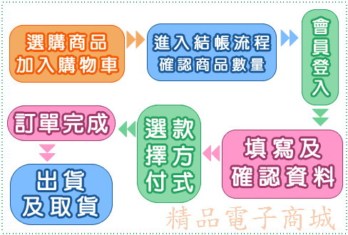

**第四題**
***
##事前準備
- 要用到jQuery但素材包沒有附->去函式庫抓
- 改圖片路徑，放到個別資料夾etc
- 快的先做 (區塊評分)
- 題目沒有要求做進佔總人數，所以可以放著
***
##切版
- under the div #right
- make the `front` and `back` folders
- copy the code snippet and paste it in the #right div of `backend.php`

```php
<?php
$do=$_GET['do']??'main';
$file="front/".$do.".php";
 if(file_exists($file)){
                include $file;
        }else{
                echo "檔案不存在";
        }
?>
```
***
##第一步
- 做連結對應front檔案
- 做back的檔案們
***
##front/look.php

```php
<div class="ct">

</div>
```
這樣就結束ㄌ
***
##front/news.php
- 開0402.txt改編碼(到big5)
- 複製到news.php
 `<marquee behavior="" direction="">年終特賣會開跑了&nbsp;&nbsp;&nbsp;&nbsp;情人節特惠活動</marquee>`
- 把一些字丟到index做marquee
 
```css
.all td
{
	min-width:50px; //改這邊
	padding:10px;
}
```
- 做最新消息的table
```html
<h2 class="ct">最新消息</h2>
<table class="all">
    <tr>
        <td class="tt">標題</td>
    </tr>
    <tr>
        <td class="pp">年終特賣會開跑了</td>
    </tr>
    <tr>
        <td class="pp">情人節特惠活動</td>
    </tr>
</table>
```

***
## back/bot.php
- table: bottom
  - id, bottom (text)
- form>table>tr>td+td>input

```html
<h2 class="ct">編輯頁尾版權區</h2>
<form action="?do=bot" method="post" class="ct">
    <table class="ct">
        <tr>
            <td class="tt">頁尾宣告內容</td>
            <td><input type="text" name="bottom" id="bot" value=<?=$Bottom->find(1)['bottom'];?> >
</td>
        </tr>
    </table>
    <div class="ct">
    <input type="submit" value="編輯">
    <input type="button" value="重置" onclick="javascript: $('#bot').val('')">
    </div>
</form>

```

```php
<?php
if(!empty($_POST['bottom'])){
    $bot=$Bottom->find(1);
    $bot['bottom']=$_POST['bottom'];
    $Bottom->save($bot);
}

?>
```
- 把 `<?=$Bottom->find(1)['bottom'];?>`貼到index和backend的頁尾區
***
##會員註冊
- login.php
- admin.php
- reg.php
- create a new database table `mem`
  - id, name, acc, pw, tel (save it in `text` because if you save it in number, the first zero will disappear), email, addr, regdate
- api/chk_acc.php
  - use jQuery to send the account you want to register to api
  - count the ones that look exactly like yours
    - if return 1, that means that account already exists
    - if not, it means that you can use that account( nobody has registered)
- api/reg.php 預設不會註冊失敗
  - save the account once you are sure the usename hasn't been registered
  - save it via post, but
    - add one section `regdate`
    - function login 可以丟到js.js(準備可以先寫)
- login.php

###驗證碼
- 存 session
- ans.php
- login.php

###管理登入
- 直接貼login的
- 改table=admin
- -記得做admin 的table
- id,acc, pw, pr(權限)
***


